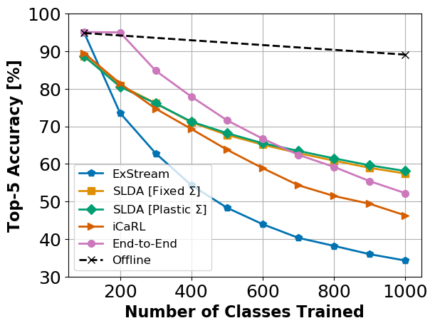

Lifelong Machine Learning with Deep Streaming Linear Discriminant Analysis
=====================================
This is a PyTorch implementation of the Deep Streaming Linear Discriminant Analysis (SLDA) algorithm from our CVPRW-2020 paper. An [arXiv pre-print](https://arxiv.org/abs/1909.01520) of our paper is available, as well as the [published paper](http://openaccess.thecvf.com/content_CVPRW_2020/html/w15/Hayes_Lifelong_Machine_Learning_With_Deep_Streaming_Linear_Discriminant_Analysis_CVPRW_2020_paper.html).

Deep SLDA combines a feature extractor with LDA to perform streaming image classification and can be thought of as a way to train the output layer of a neural network. Deep SLDA only requires the storage of a single shared covariance matrix beyond its feature extraction CNN, making its memory requirements very low, e.g., 0.001 GB for our experiments with ResNet-18. Further, once initialized, Deep SLDA is able to train incrementally on the ImageNet dataset in roughly 30 minutes on a Titan X GPU. This is remarkable as methods like iCaRL require 3.011 GB of storage beyond the CNN and require 62 hours to train on the same hardware.

## Dependences 
- Tested with Python 3.6 and PyTorch 1.1.0, or Python 3.7 and PyTorch 1.3.1, NumPy, NVIDIA GPU
- **Dataset:** 
  - ImageNet-1K (ILSVRC2012) -- Download the ImageNet-1K dataset and move validation images to labeled sub-folders. [See link.](https://github.com/facebook/fb.resnet.torch/blob/master/INSTALL.md#download-the-imagenet-dataset)
  
## Usage
To replicate the SLDA experiments on ImageNet-1K, change necessary paths and run from terminal:
- `slda_imagenet.sh`

Alternatively, setup appropriate parameters and run directly in python:
- `python experiment.py`

## Implementation Notes
When run, the script will save out network probabilities (torch files) and accuracies (json files) after every 100 classes in a directory called `./streaming_experiments/*expt_name*`. 

We have included all necessary files to replicate our ImageNet-1K experiments. Note that the checkpoint file provided in `image_files` has only been trained on the base 100 classes. However, for other datasets you may want a checkpoint trained on the entire ImageNet-1K dataset, e.g., our CORe50 experiments. Simply change line 196 of `experiment.py` to `feature_extraction_model = get_feature_extraction_model(None, imagenet_pretrained=True).eval()` to use ImageNet-1K pre-trained weights from PyTorch.

Other datasets can be used by implementing a PyTorch dataloader for them.

If you would like to start streaming from scratch without a base initialization phase, simply leave out the call to `fit_base`.

## Results on ImageNet ILSVRC-2012


## Citation
If using this code, please cite our paper.
```
@InProceedings{Hayes_2020_CVPR_Workshops,
    author = {Hayes, Tyler L. and Kanan, Christopher},
    title = {Lifelong Machine Learning With Deep Streaming Linear Discriminant Analysis},
    booktitle = {The IEEE/CVF Conference on Computer Vision and Pattern Recognition (CVPR) Workshops},
    month = {June},
    year = {2020}
}
